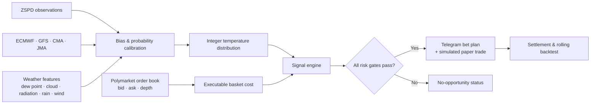
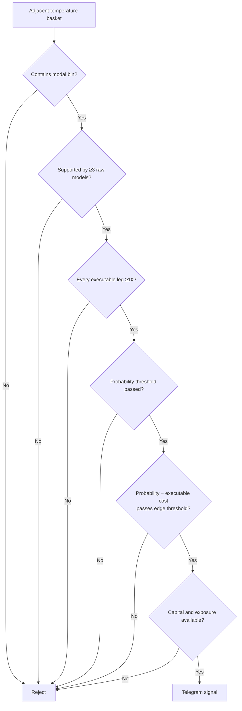
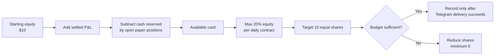
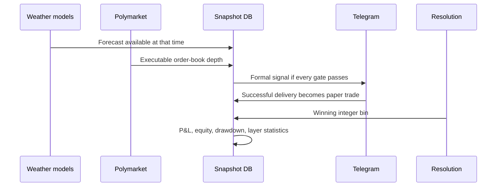

# Shanghai Temperature Oracle

**English** | [简体中文](README.zh-CN.md)

A quantitative decision system for Shanghai maximum-temperature prediction markets. It combines archived weather-model calibration, live multi-model forecasts, executable Polymarket order-book depth, layered risk filters, Telegram alerts, and point-in-time trade backtesting.

> Research software only. It does not place orders automatically, and forecast edge is not guaranteed profit.

## Strategy at a Glance

The forecast target and settlement reference are Shanghai Pudong International Airport (ZSPD). The model produces probabilities for integer temperature bins rather than relying only on a single point forecast.

## Signal Decision Funnel

A two-bin or three-bin adjacent basket is eligible only when every gate passes:

Historical bias correction is capped at ±1°C relative to the current raw multi-model center. Order cost is calculated by walking live ask depth for equal shares in every selected bin.

## Time-to-Close Layers

The production monitor follows both today's and tomorrow's markets. Remaining time comes from Polymarket's official event end time.

| Layer | Minimum basket probability | Minimum model edge |
|---|---:|---:|
| 24h | 50% | 10% |
| 12h | 52% | 8% |
| 6h | 55% | 6% |
| 3h | 60% | 5% |

Closer to settlement, the system requires higher absolute probability while allowing a smaller pricing edge. Results are measured independently for every layer.

## Capital and Execution Policy

The paper ledger treats every successfully delivered formal Telegram bet alert as one simulated trade. No-opportunity notices are not trades. Fees are excluded from the signal rule and current P&L report, so reported returns may overstate realizable returns.

## Weather Backtest Results

All weather results use walk-forward evaluation rather than random train/test shuffling.

### Enhanced archived D+1 model

Period: 2025-01-19 to 2026-08-12, 571 observations.

| Model | MAE | RMSE | Exact integer | Adjacent integer |
|---|---:|---:|---:|---:|
| Enhanced weather features | 0.862°C | 1.150°C | 38.0% | 82.8% |
| Online meta strategy | **0.856°C** | **1.143°C** | 38.7% | 82.5% |
| Discrete bin strategy | **0.837°C** | 1.194°C | **38.9%** | 82.5% |
| Previous temperature-only ensemble | 0.995°C | 1.281°C | 32.0% | 78.5% |

On actual hot days at or above 30°C, the enhanced model achieved 0.843°C MAE and 41.9% exact-integer accuracy over 160 observations.

### Archived multi-model ensemble

D+1 period: 2024-04-05 to 2026-08-12, 860 observations.

| Forecast | MAE | RMSE | Bias | Exact integer |
|---|---:|---:|---:|---:|
| Rolling calibrated ensemble | **0.977°C** | **1.277°C** | -0.038°C | **33.1%** |
| Raw equal-weight ensemble | 1.800°C | 2.163°C | -1.669°C | 14.4% |
| GFS | 1.431°C | 1.806°C | -1.090°C | 21.0% |
| ECMWF | 1.524°C | 1.876°C | -1.278°C | 16.7% |

These figures evaluate temperature forecasting, not trading profitability.

## Live Trade Backtest Status

The live database stores immutable model state, quotes, full ask depth, candidate baskets, filter decisions, Telegram deliveries, and settlement results.

The production service also sends a Telegram health heartbeat after every 30-minute cycle, reporting whether both today's and tomorrow's market checks completed successfully.

| Metric | Current status |
|---|---:|
| Point-in-time snapshot runs | 6 |
| Stored outcome rows | 66 |
| Tracked unresolved contracts | 2 |
| Formal paper-trade alerts | 0 |
| Resolved paper trades | 0 |

The trade sample is not yet large enough to estimate hit rate, return, or drawdown. No trading-performance claim should be made until a meaningful number of alerts have settled. The report will later break down hit rate, P&L, and average entry edge across the 24h/12h/6h/3h layers.

## Backtest Integrity

Historical quotes are never replaced with final prices. This prevents look-ahead leakage in the trade-level rolling backtest.
