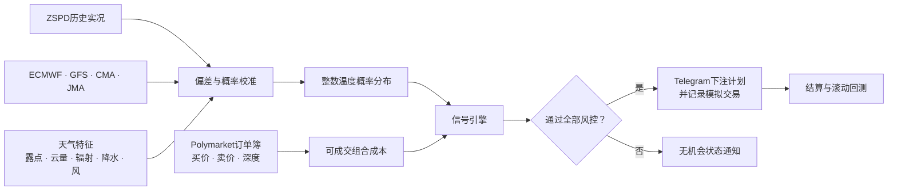
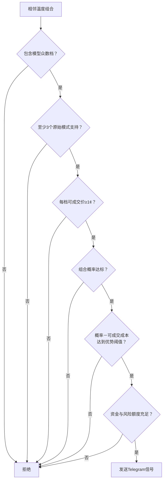
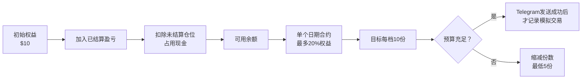
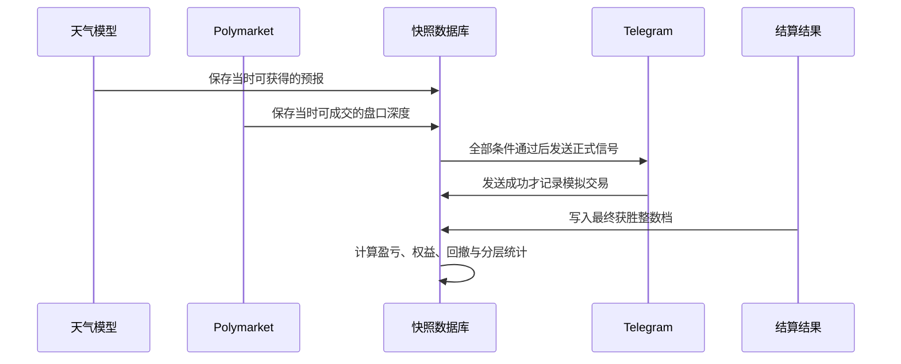

# 上海最高温量化预测系统

[English](README.md) | **简体中文**

面向上海最高气温预测市场的量化决策系统。它结合历史数值预报校准、实时多模式天气预报、Polymarket可成交订单簿、分层风险过滤、Telegram通知和不可回看的交易级滚动回测。

> 仅用于研究。系统不会自动执行真实下单，模型优势也不等于保证盈利。

## 策略全景

预测目标及结算参考站为上海浦东国际机场ZSPD。模型输出整数温度档概率，而不是只给出一个点预测。

## 信号决策漏斗

相邻双档或三档组合必须同时通过全部条件：

历史偏差校准相对当日原始多模式中心最多移动±1°C。组合成本按订单簿逐层吃单计算，并要求所有温度档买入相同份数。

## 距离结算时间分层

生产任务同时监控今日和次日市场，剩余时间使用Polymarket官方事件结束时间计算。

| 分层 | 最低组合概率 | 最低模型优势 |
|---|---:|---:|
| 24h | 50% | 10% |
| 12h | 52% | 8% |
| 6h | 55% | 6% |
| 3h | 60% | 5% |

越临近结算，系统要求更高的绝对胜率，同时允许更小的定价优势。各时间层独立统计表现。

## 资金与成交策略

每次正式Telegram下注通知成功送达，就记录一笔模拟交易；无机会通知不计交易。当前信号与盈亏报告均未扣手续费，因此实际可实现收益可能低于回测值。

## 天气模型回测

所有结果均采用时间顺序滚动回测，没有随机打乱数据。

### 增强D+1留档模型

区间：2025-01-19至2026-08-12，共571期。

| 模型 | MAE | RMSE | 整数档命中 | 相邻档命中 |
|---|---:|---:|---:|---:|
| 增强天气特征 | 0.862°C | 1.150°C | 38.0% | 82.8% |
| 在线元策略 | **0.856°C** | **1.143°C** | 38.7% | 82.5% |
| 离散温度档策略 | **0.837°C** | 1.194°C | **38.9%** | 82.5% |
| 原温度动态集合 | 0.995°C | 1.281°C | 32.0% | 78.5% |

实际最高温不低于30°C的160个高温日中，增强模型MAE为0.843°C，整数档命中率为41.9%。

### 多模式留档集合

D+1区间：2024-04-05至2026-08-12，共860期。

| 预报 | MAE | RMSE | 偏差 | 整数档命中 |
|---|---:|---:|---:|---:|
| 滚动校准集合 | **0.977°C** | **1.277°C** | -0.038°C | **33.1%** |
| 原始等权集合 | 1.800°C | 2.163°C | -1.669°C | 14.4% |
| GFS | 1.431°C | 1.806°C | -1.090°C | 21.0% |
| ECMWF | 1.524°C | 1.876°C | -1.278°C | 16.7% |

这些数字衡量天气预测能力，不代表交易收益率。

## 实时交易回测状态

实时数据库保存不可回看的模型状态、盘口、完整卖盘深度、候选组合、过滤结果、Telegram送达记录和结算结果。

生产服务每30分钟任务结束后还会发送Telegram健康心跳，分别报告今日和次日市场检查是否成功。

| 指标 | 当前状态 |
|---|---:|
| 实时快照次数 | 6 |
| 已保存温度档记录 | 66 |
| 未结算合约 | 2 |
| 正式模拟下注通知 | 0 |
| 已结算模拟交易 | 0 |

目前交易样本不足，不能估计胜率、收益率或最大回撤。在积累足够的已结算信号前，不应宣称交易策略有效。后续报告会分别展示24h/12h/6h/3h各层的命中率、盈亏和平均入场优势。

## 回测完整性

历史盘口不会被最终价格覆盖，从而避免交易级滚动回测中的未来数据泄漏。
